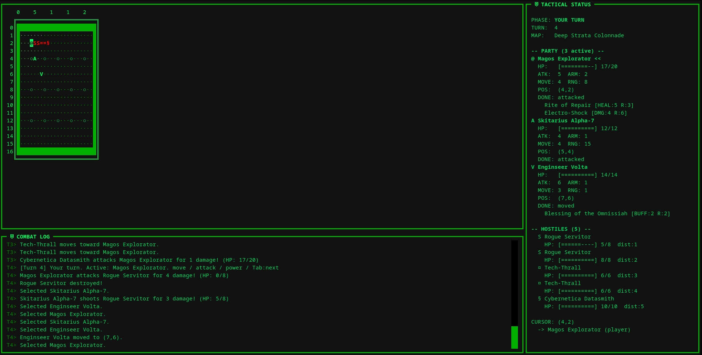
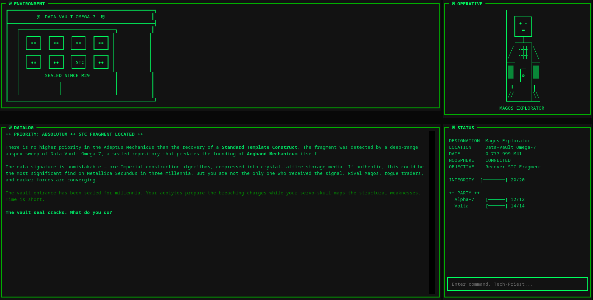

# Angband Mechanicum

Explore a generative world with turn-based combat while interacting with natural language prompts.

## Requirements

- Python 3.11+
- [uv](https://docs.astral.sh/uv/)
- An Anthropic API key (`ANTHROPIC_API_KEY` environment variable)

## Run

```bash
uv sync
uv run angband-mechanicum
```

## Screenshots



