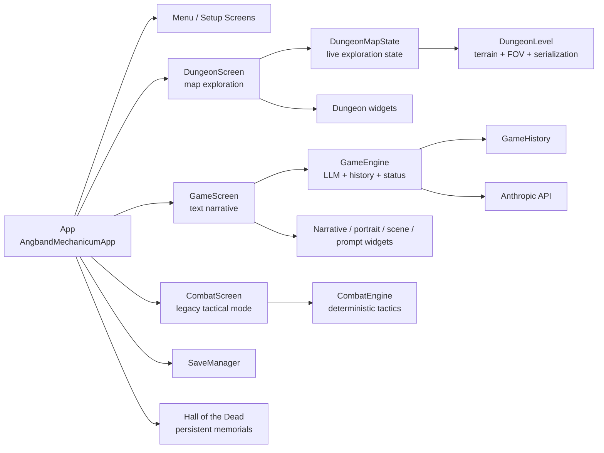
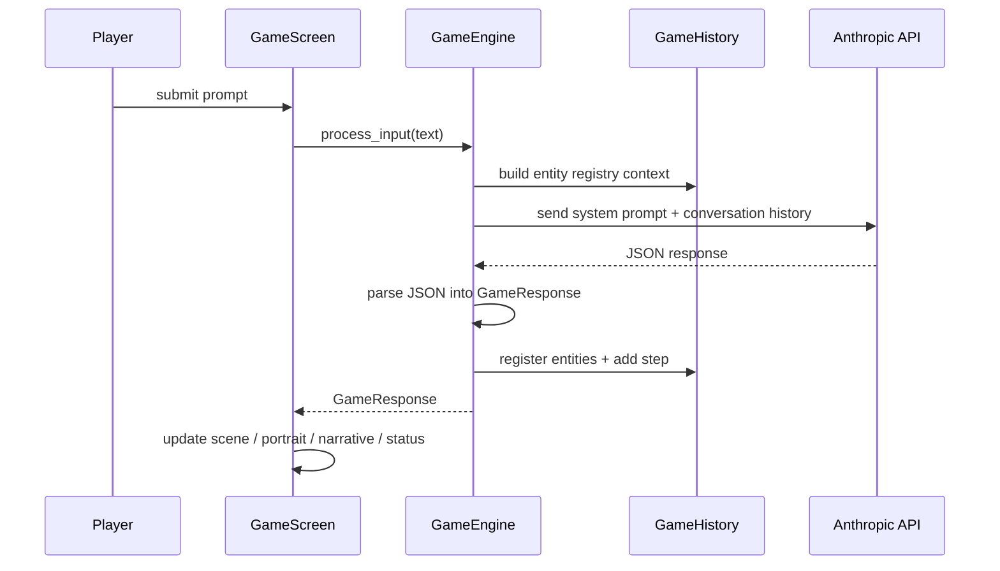
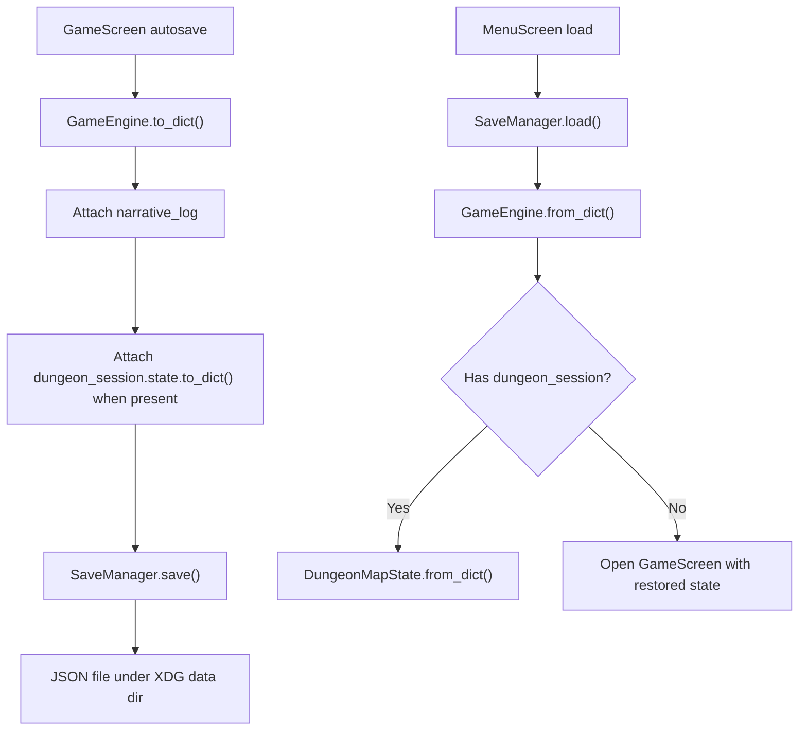

# Architecture

Angband Mechanicum is a Textual-based terminal game with two primary interaction modes:

- `DungeonScreen` for exploration on a persistent tile map
- `GameScreen` for narrative, dialogue, and other LLM-driven text interactions

The current codebase still contains a separate `CombatScreen` and `CombatEngine`. That path is functional, but it is now the legacy tactical subsystem alongside the newer unified dungeon path.

## Goals Of This Document

- Give future agents and humans a fast architectural orientation
- Show where UI, engine, persistence, and content responsibilities live
- Make the current code flow and data flow explicit
- Provide a file map of the architecture-relevant repository surface

## Key References

- Project context: [docs/context.md](./context.md)
- App entrypoint: [src/angband_mechanicum/app.py](../src/angband_mechanicum/app.py)
- Narrative engine seam: [src/angband_mechanicum/engine/game_engine.py](../src/angband_mechanicum/engine/game_engine.py)
- Dungeon shell: [src/angband_mechanicum/screens/dungeon_screen.py](../src/angband_mechanicum/screens/dungeon_screen.py)
- Text view shell: [src/angband_mechanicum/screens/game_screen.py](../src/angband_mechanicum/screens/game_screen.py)
- Textual docs: <https://textual.textualize.io/>
- Anthropic Python SDK: <https://github.com/anthropics/anthropic-sdk-python>

## Architectural Summary

At a high level, the app is organized into four layers:

1. App orchestration
   - `AngbandMechanicumApp` owns shared state such as the active `GameEngine`, current save slot, and persistent `DungeonSession`.
2. Screens and widgets
   - `screens/` handles interaction flow and screen-level behavior.
   - `widgets/` handles display and input widgets with minimal game logic.
3. Engine layer
   - `engine/` holds deterministic game models, procedural generation, persistence, and the LLM-facing narrative engine.
4. Content and configuration
   - `assets/`, `story_starts.py`, theme, TCSS, and top-level project config shape the presentation and starting content.

The main architectural seam is:

- UI code does not call the LLM directly.
- `GameEngine` is the boundary for narrative generation and structured world-memory updates.
- Death narration also lives behind `GameEngine`; the UI asks for a memorial summary and then persists it through `SaveManager`.

## Runtime Topology



## Startup And Screen Flow

```mermaid
flowchart TD
    A["main()"] --> B["AngbandMechanicumApp()"]
    B --> C["on_mount()"]
    C --> D{"ANTHROPIC_API_KEY set?"}
    D -->|No| E["ApiKeyScreen"]
    D -->|Yes| F["MenuScreen"]
    E --> F
    F --> G["CharacterSetupScreen"]
    G --> H["StorySelectScreen"]
    H --> I["begin_new_game()"]
    I --> J["GameEngine.apply_story_start()"]
    I --> K["build_dungeon_session()"]
    K --> L["GameScreen<br/>story intro"]
    L -->|/explore| M["DungeonScreen"]
    F --> R["HallOfDeadScreen"]

    M -->|conversation/object interaction| N["open_text_view()"]
    N --> O["GameScreen"]
    O -->|return_to_dungeon_view()| M
    O -->|combat trigger or /combat| P["CombatScreen"]
    P --> O
    O -->|death| Q["archive_player_death()"]
    Q --> R["MenuScreen"]
```

## Primary Code Flows

### 1. New game flow

- `MenuScreen` starts the new-game workflow.
- `CharacterSetupScreen` captures the player name.
- `StorySelectScreen` chooses a `StoryStart`.
- `AngbandMechanicumApp.begin_new_game()` creates a fresh `GameEngine`, applies story setup, creates a save slot, seeds a dungeon session, and opens `GameScreen` with the story intro already printed.
- The player uses `/explore` to enter `DungeonScreen` while preserving the same `DungeonSession`.

Primary files:

- [src/angband_mechanicum/screens/menu_screen.py](../src/angband_mechanicum/screens/menu_screen.py)
- [src/angband_mechanicum/screens/character_setup_screen.py](../src/angband_mechanicum/screens/character_setup_screen.py)
- [src/angband_mechanicum/screens/story_select_screen.py](../src/angband_mechanicum/screens/story_select_screen.py)
- [src/angband_mechanicum/app.py](../src/angband_mechanicum/app.py)
- [src/angband_mechanicum/engine/story_starts.py](../src/angband_mechanicum/engine/story_starts.py)

### 2. Dungeon exploration flow

- `DungeonScreen` owns or receives a `DungeonMapState`.
- `DungeonMapState` wraps a persistent `DungeonLevel`, player position, FOV radius, messages, and lightweight map entities.
- `generate_dungeon_floor()` now seeds a small environment-aware roster of hostile and non-hostile contacts alongside the floor geometry.
- Fresh sessions and descended floors convert `entity_roster` entries into live map contacts, so generated NPCs persist through movement and save/load.
- Movement and bump interactions are resolved by `DungeonMapState.attempt_step()`.
- Ctrl+direction travel reuses the same step resolution and stops when the path opens up, a contact appears, or combat/terrain interrupts control.
- Transition tiles are resolved in the app layer: the current floor is cached in the session stack, then a new or restored `DungeonMapState` is mounted for the destination level.
- `DungeonTransitionPane.show_inspect()` renders ambient discoveries by keeping `scene_art` on unwrapped lines while allowing `narrative_text` to wrap to the pane width.
- The screen refreshes the render widgets after each action.
- Conversations or object interactions transition to `GameScreen` through app-level bridging.

Primary files:

- [src/angband_mechanicum/screens/dungeon_screen.py](../src/angband_mechanicum/screens/dungeon_screen.py)
- [src/angband_mechanicum/widgets/dungeon_map.py](../src/angband_mechanicum/widgets/dungeon_map.py)
- [src/angband_mechanicum/engine/dungeon_level.py](../src/angband_mechanicum/engine/dungeon_level.py)
- [src/angband_mechanicum/engine/dungeon_gen.py](../src/angband_mechanicum/engine/dungeon_gen.py)

### 3. Text narrative flow

- `GameScreen` captures prompt input and submits it to `GameEngine.process_input()`.
- When `GameScreen` was opened from a dungeon interaction, it also seeds a focused interaction context into `GameEngine` so follow-up dialogue stays grounded in the addressed target and current dungeon location.
- `GameEngine` builds a system prompt using:
  - current story context
  - dynamic scene-pane dimensions
  - structured entity registry from `GameHistory`
- The LLM response is parsed from JSON into a `GameResponse`.
- `GameEngine` updates:
  - conversation history
  - world entity registry
  - turn history
  - info panel state
  - current scene art
- `GameScreen` updates narrative, portrait, scene, and status widgets from the response.

Primary files:

- [src/angband_mechanicum/screens/game_screen.py](../src/angband_mechanicum/screens/game_screen.py)
- [src/angband_mechanicum/engine/game_engine.py](../src/angband_mechanicum/engine/game_engine.py)
- [src/angband_mechanicum/engine/history.py](../src/angband_mechanicum/engine/history.py)
- [src/angband_mechanicum/widgets/narrative_pane.py](../src/angband_mechanicum/widgets/narrative_pane.py)
- [src/angband_mechanicum/widgets/info_panel.py](../src/angband_mechanicum/widgets/info_panel.py)

### 4. Legacy tactical combat flow

- `GameScreen` can enter combat either explicitly (`/combat`) or from an LLM `combat_trigger`.
- `GameEngine.generate_encounter()` uses the LLM to produce an enemy roster and optional map hint.
- `CombatScreen` hosts `CombatEngine` and the combat widgets.
- Combat resolves into a `CombatResult`.
- `GameScreen` writes the result back into narrative history and player integrity.

Primary files:

- [src/angband_mechanicum/screens/combat_screen.py](../src/angband_mechanicum/screens/combat_screen.py)
- [src/angband_mechanicum/engine/combat_engine.py](../src/angband_mechanicum/engine/combat_engine.py)
- [src/angband_mechanicum/widgets/combat_grid.py](../src/angband_mechanicum/widgets/combat_grid.py)
- [src/angband_mechanicum/widgets/combat_info.py](../src/angband_mechanicum/widgets/combat_info.py)
- [src/angband_mechanicum/widgets/combat_log.py](../src/angband_mechanicum/widgets/combat_log.py)

### 5. Permadeath And Hall Flow

- On defeat, `GameScreen` asks `GameEngine` for a memorial summary, creates a `DeathRecord`, and hands it to `AngbandMechanicumApp.archive_player_death()`.
- `archive_player_death()` persists the memorial, deletes the live save, resets transient dungeon state, and returns to the main menu.
- `MenuScreen` now exposes `HallOfDeadScreen`, which reads persisted memorials from `SaveManager`.

Primary files:

- [src/angband_mechanicum/screens/game_screen.py](../src/angband_mechanicum/screens/game_screen.py)
- [src/angband_mechanicum/app.py](../src/angband_mechanicum/app.py)
- [src/angband_mechanicum/screens/menu_screen.py](../src/angband_mechanicum/screens/menu_screen.py)
- [src/angband_mechanicum/screens/hall_of_dead_screen.py](../src/angband_mechanicum/screens/hall_of_dead_screen.py)
- [src/angband_mechanicum/engine/save_manager.py](../src/angband_mechanicum/engine/save_manager.py)

## Data Flow

### Narrative Request/Response Flow



### Map/Text Bridge Flow

```mermaid
flowchart LR
    A["DungeonScreen"] -->|conversation / object interaction| B["build_text_view_context()"]
    B --> C["AngbandMechanicumApp.open_text_view()"]
    C --> D["GameScreen"]
    D -->|return_to_dungeon()| E["AngbandMechanicumApp.return_to_dungeon_view()"]
    E --> F["DungeonSession.state updated"]
    F --> A
```

### Persistence Flow



## Important State Models

### App-owned state

Owned by `AngbandMechanicumApp` in [src/angband_mechanicum/app.py](../src/angband_mechanicum/app.py):

- `game_engine`
- `save_slot`
- `dungeon_session`
- `_story_start`

This is the top-level coordinator that bridges screen transitions and persists shared session state.

### `DungeonSession`

Also in [src/angband_mechanicum/app.py](../src/angband_mechanicum/app.py):

- Holds the persistent dungeon-side state
- Stores the active `DungeonMapState`
- Carries location, story id, intro narrative, and pending text-context fields

### `DungeonMapState`

Defined in [src/angband_mechanicum/screens/dungeon_screen.py](../src/angband_mechanicum/screens/dungeon_screen.py):

- `level: DungeonLevel`
- `player_pos`
- `fov_radius`
- `player_attack`
- `entities`
- `messages`

This is the mutable exploration session state and the immediate action-resolution surface for the map view.

### `DungeonLevel`

Defined in [src/angband_mechanicum/engine/dungeon_level.py](../src/angband_mechanicum/engine/dungeon_level.py):

- Persistent terrain grid
- Fog-of-war state
- FOV and line-of-sight helpers
- Serialization boundary for save/load

This is the exploration map data model. It intentionally avoids UI concerns.

### `GameEngine`

Defined in [src/angband_mechanicum/engine/game_engine.py](../src/angband_mechanicum/engine/game_engine.py):

- Narrative processing via Anthropic
- Conversation history
- Turn count and current scene art
- Info panel fields
- Integrity and party HP
- Structured `GameHistory`

This is the LLM seam and the main text-mode state owner.

### `GameHistory`

Defined in [src/angband_mechanicum/engine/history.py](../src/angband_mechanicum/engine/history.py):

- Stable entity registry
- Step log with entity cross-references
- Context builders for future prompts

This is what keeps the text-mode world model from being only free-form chat history.

## Separation Of Concerns

### What belongs in `screens/`

- Screen composition
- Key bindings
- Mode transitions
- Wiring user actions to engine calls

### What belongs in `widgets/`

- Rendering
- Display formatting
- Small UI-only behaviors

Widgets should stay as dumb as practical. This is mostly true in the current codebase.

### What belongs in `engine/`

- Deterministic rules
- Serializable state
- Procedural generation
- World memory
- Persistence
- LLM integration boundary

## Current Architectural Tension

The repository currently has two map/combat representations:

- `DungeonLevel` for exploration-scale tile maps
- `Grid` in `combat_engine.py` for legacy tactical combat

And two related play loops:

- The newer unified dungeon path in `DungeonScreen`
- The older tactical combat path in `CombatScreen`

This is the main transitional seam future agents should understand. If implementing new exploration features, prefer the dungeon stack unless the work is explicitly about the legacy tactical subsystem.

## Recommended Extension Points

When adding features, these are the safest current seams:

- New exploration logic: [src/angband_mechanicum/screens/dungeon_screen.py](../src/angband_mechanicum/screens/dungeon_screen.py) and [src/angband_mechanicum/engine/dungeon_level.py](../src/angband_mechanicum/engine/dungeon_level.py)
- New dungeon generation behavior: [src/angband_mechanicum/engine/dungeon_gen.py](../src/angband_mechanicum/engine/dungeon_gen.py)
- New NPC/entity map behavior: [src/angband_mechanicum/engine/dungeon_entities.py](../src/angband_mechanicum/engine/dungeon_entities.py)
- New LLM-visible world context: [src/angband_mechanicum/engine/history.py](../src/angband_mechanicum/engine/history.py)
- New text-mode behavior: [src/angband_mechanicum/engine/game_engine.py](../src/angband_mechanicum/engine/game_engine.py)
- New display-only UI: `widgets/`
- New mission starts: [src/angband_mechanicum/engine/story_starts.py](../src/angband_mechanicum/engine/story_starts.py)

## File Map

The tree below focuses on tracked, architecture-relevant files. Generated caches and the individual `.tickets/*.md` backlog files are omitted from the detailed expansion.

```text
.
|-- .gitignore                          - Git ignore rules.
|-- .python-version                     - Local Python version pin.
|-- AGENTS.md                           - Repository-specific instructions for coding agents.
|-- CLAUDE.md                           - Additional agent guidance for working in this repo.
|-- README.md                           - Short project intro, requirements, and screenshots.
|-- pyproject.toml                      - Package metadata, dependencies, script entrypoint, mypy, pytest config.
|-- uv.lock                             - Locked dependency graph for uv.
|-- .tickets/                           - Ticket tracker storage used by `tk`; each markdown file is a work item.
|-- docs/
|   |-- architecture.md                 - This architecture guide.
|   |-- context.md                      - High-level product and mode-design context.
|   |-- AngMech1_Combat.png             - Screenshot of the combat UI.
|   |-- AngMech1_Text.png               - Screenshot of the text-view UI.
|   `-- plans/
|       `-- realtime-arpg.md            - Design plan for a future real-time mode.
|-- src/
|   `-- angband_mechanicum/
|       |-- __init__.py                 - Package marker.
|       |-- app.py                      - App entrypoint, global session state, and screen-bridge orchestration.
|       |-- py.typed                    - Marks the package as typed for type checkers.
|       |-- theme.py                    - Registers the CRT-green Textual theme.
|       |-- styles/
|       |   `-- game.tcss               - Shared Textual CSS for screens and widgets.
|       |-- assets/
|       |   |-- __init__.py             - Package marker for asset modules.
|       |   |-- npc_portraits.py        - NPC portrait store and portrait assignment helpers.
|       |   |-- placeholder_art.py      - Default intro text and baseline ASCII/unicode art.
|       |   `-- portraits.py            - Portrait art library used by the UI.
|       |-- engine/
|       |   |-- __init__.py             - Engine package marker.
|       |   |-- combat_engine.py        - Deterministic legacy tactical combat rules, units, maps, AI, and results.
|       |   |-- dungeon_entities.py     - Dungeon NPC/creature models, party-follow logic, and placement helpers.
|       |   |-- dungeon_gen.py          - Procedural room and floor generation for combat maps and exploration floors.
|       |   |-- dungeon_level.py        - Persistent exploration tile-map model, terrain definitions, FOV, and serialization.
|       |   |-- game_engine.py          - Narrative engine, Anthropic integration, encounter generation, status state, and save schema.
|       |   |-- history.py              - Structured step log and entity registry for LLM context.
|       |   |-- save_manager.py         - JSON save/load manager with XDG-aware save directory handling.
|       |   `-- story_starts.py         - Curated story-start scenarios and intro payloads.
|       |-- screens/
|       |   |-- __init__.py             - Screens package marker.
|       |   |-- api_key_screen.py       - API-key bootstrap screen for Anthropic authentication.
|       |   |-- character_setup_screen.py - New-game naming flow for the player Tech-Priest.
|       |   |-- combat_screen.py        - Full-screen legacy tactical combat shell over `CombatEngine`.
|       |   |-- dungeon_screen.py       - Unified exploration screen and `DungeonMapState` action loop.
|       |   |-- game_screen.py          - Four-pane text-view shell and text/combat integration layer.
|       |   |-- menu_screen.py          - Main menu and save-loading entrypoint.
|       |   `-- story_select_screen.py  - Mission/story-start selection screen.
|       `-- widgets/
|           |-- __init__.py             - Widgets package marker.
|           |-- combat_grid.py          - Rich-text tactical grid renderer for legacy combat.
|           |-- combat_info.py          - Sidebar renderer for legacy combat stats and powers.
|           |-- combat_log.py           - Combat event log widget.
|           |-- dungeon_map.py          - Dungeon map/status renderers and widgets for exploration mode.
|           |-- help_overlay.py         - Reusable modal help screen for hotkey summaries.
|           |-- info_panel.py           - Text-view status panel renderer for player info and party HP.
|           |-- narrative_pane.py       - Scrollable narrative log with loading support.
|           |-- portrait_pane.py        - Portrait display widget.
|           |-- prompt_input.py         - Prompt widget with processing-state behavior.
|           `-- scene_pane.py           - Environment art display widget.
`-- tests/
    |-- __init__.py                     - Tests package marker.
    |-- conftest.py                     - Shared fixtures and Anthropic client mocks.
    |-- test_combat_engine.py           - Unit tests for tactical combat rules and serialization.
    |-- test_dungeon_entities.py        - Tests for dungeon entity metadata, placement, and movement behavior.
    |-- test_dungeon_gen.py             - Tests for procedural room/floor generation and terrain extensions.
    |-- test_dungeon_level.py           - Tests for exploration FOV, LOS, fog, and serialization.
    |-- test_dungeon_screen.py          - Tests for dungeon rendering and interaction-state behavior.
    |-- test_e2e.py                     - Textual pilot smoke tests for end-to-end app flows.
    |-- test_game_engine.py             - Tests for narrative engine parsing, state, and API handling.
    |-- test_save_manager.py            - Tests for save/load behavior and metadata ordering.
    `-- test_widgets.py                 - Widget-formatting tests for combat and info-panel rendering.
```

## Testing Surface

The repo has a healthy split of tests:

- engine unit tests
- dungeon-specific model tests
- widget rendering tests
- end-to-end Textual pilot tests

Start here when changing architecture-sensitive code:

- [tests/test_e2e.py](../tests/test_e2e.py)
- [tests/test_game_engine.py](../tests/test_game_engine.py)
- [tests/test_dungeon_screen.py](../tests/test_dungeon_screen.py)
- [tests/test_dungeon_level.py](../tests/test_dungeon_level.py)
- [tests/test_dungeon_gen.py](../tests/test_dungeon_gen.py)

## Practical Notes For Future Agents

- Treat `GameEngine` as the only LLM integration seam.
- Prefer `DungeonLevel` and `DungeonScreen` for new exploration work.
- Assume `CombatScreen` is legacy unless the ticket explicitly targets it.
- Keep widgets display-focused and push rules into `engine/`.
- Preserve the CRT-green presentation language unless intentionally revising the theme.
- If changing save schema, review both `GameEngine.to_dict()/from_dict()` and `DungeonMapState.to_dict()/from_dict()`.
